# Lock-In 🔒

**A cute, tamper-resistant focus app for Android — like Strava, but for staying off your phone.**

Lock-In turns "I stayed focused" into something you can actually *prove* to your friends. Start a
lock-in, and a reactive blob mascot keeps you company while the app watches — at the OS level — whether
you're really heads-down or sneaking off to Instagram. Slip up and a hard-to-silence alarm calls you out.
Focus with friends in Discord-style group rooms, keep a streak, earn Sparkles, and dress up your buddy.

<p align="center">
  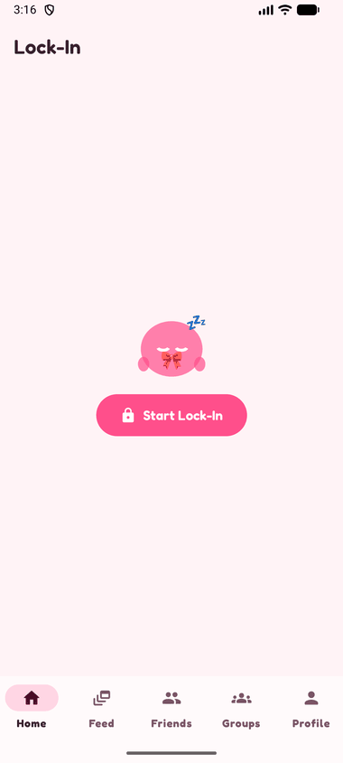
</p>

<p align="center">
  
  
  
  
</p>

---

## The problem

Fitness has Strava. Reading has Goodreads. But "digital minimalism" — actually staying off your phone —
has no trusted social layer. Every existing solution runs on the honor system: manual screenshots,
self-reported timers, streaks you can fake in two taps. There's no *verified* way to share "I locked in
for two hours," so there's no real accountability and no social pressure to keep it up.

**Lock-In's bet: make every compliance state system-detected, never self-reported — then make it social.**

---

## What it does

### 🔒 The lock-in
Tap **Start Lock-In** and the session begins. Your blob mascot wakes up, a timer counts, and the app
starts checking your foreground app against your personal **allowlist** (study apps, Spotify, etc.).
Screen off? Compliant. On an allowed app? Compliant. Open a game or social feed? **Break detected** — the
mascot panics and an alarm fires. Finish clean and you get a happy payoff + an end-of-session summary.

### 🛡️ Anti-cheat that actually resists cheating
The detection backbone is deliberately **fail-closed**: it assumes you're *not* focused unless it can
prove otherwise. Revoke the app's Usage Access mid-session to blind it? That reads as a break and the
alarm fires anyway. Force-kill the app to dodge the alarm? A per-tick heartbeat goes stale and the phantom
session is voided on next launch — no streak, no Sparkles, no feed credit. Your **allowlist is visible to
your friends**, so you can't quietly whitelist TikTok. ([How it works ↓](#how-the-anti-cheat-works))

### 👥 Focus together — Discord-style groups
A group is a persistent **server** with a roster, group chat, and **owner/admin roles**. Inside it, anyone
can spin up a live **lobby** that others hop into as they arrive. When someone breaks, the whole room
sees it — and silencing a group alarm needs the room's **approval** (a configurable threshold), not just a
tap from the person who slipped.

### 📈 A feed worth showing off
Every completed lock-in posts to a friend-visible activity feed — duration, breaks and all (no hiding your
slips; that's the point). Kudos your friends, keep a **streak** (with a friend-visible minimum so you
can't secretly farm it), and unlock **achievements** derived from your real history.

### ✨ A mascot economy
Earn **1 Sparkle per minute** locked in. Spend them in the shop on accessories, or unlock signature cosmetics
from your **trophy case** by earning achievements. Your buddy recolors to match your theme and reacts to
every session — sleepy, focused, panicking, or celebrating.

### 🎨 Made to look at
A bold **"Bubblegum"** design language — chunky rounded type, candy-pink palette, character-first — with a
full **Light / Dark / System** mode and a set of accent themes (Bubblegum · Peach · Berry · Sunset).

---

## Gallery

<table>
  <tr>
    <td align="center"><b>Home</b></td>
    <td align="center"><b>Focus session</b></td>
    <td align="center"><b>Feed</b></td>
  </tr>
  <tr>
    <td>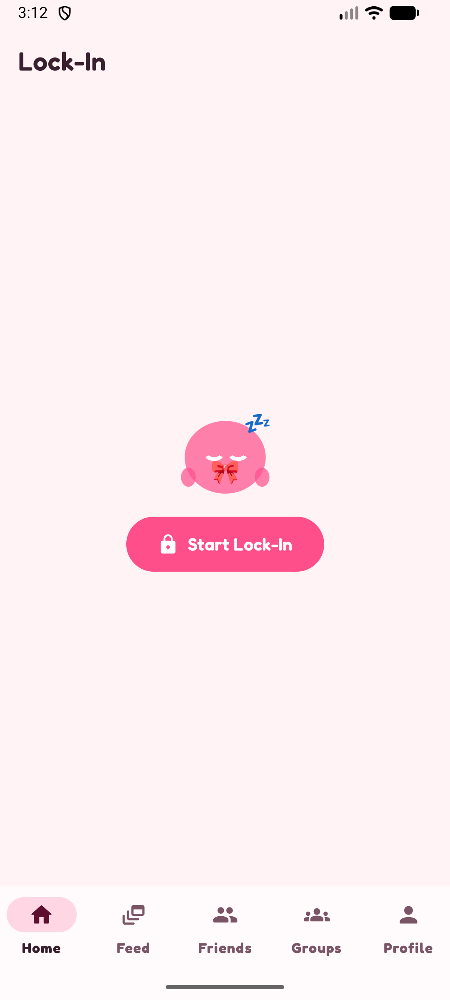</td>
    <td>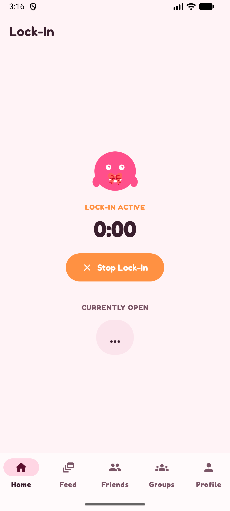</td>
    <td>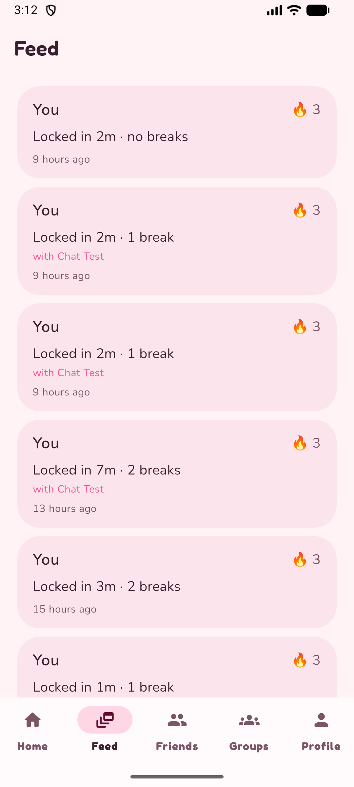</td>
  </tr>
  <tr>
    <td>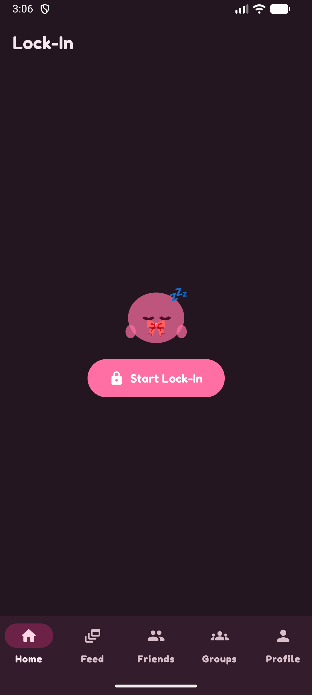</td>
    <td>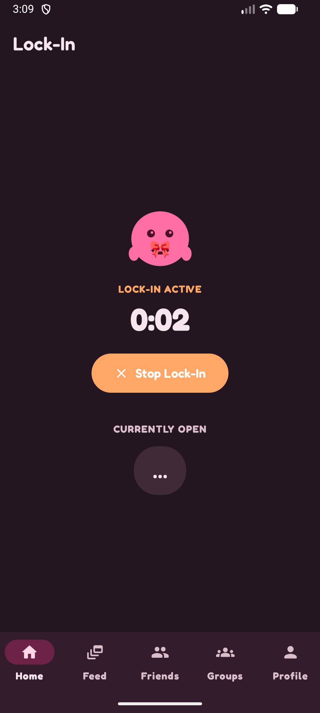</td>
    <td>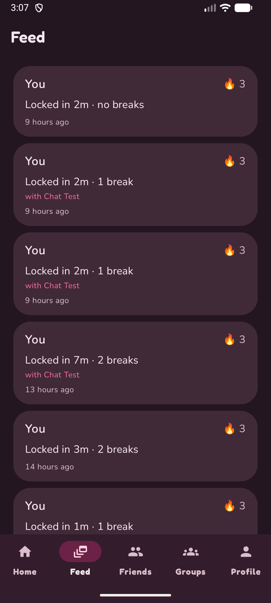</td>
  </tr>
  <tr>
    <td align="center"><b>Group · Members & roles</b></td>
    <td align="center"><b>Group · Chat</b></td>
    <td align="center"><b>Mascot economy</b></td>
  </tr>
  <tr>
    <td>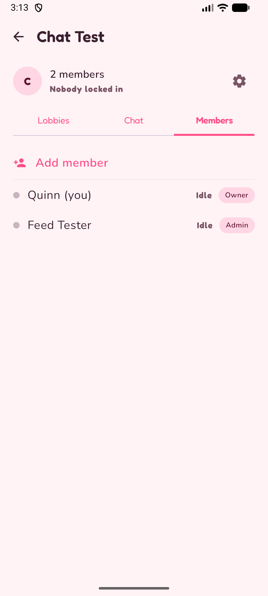</td>
    <td>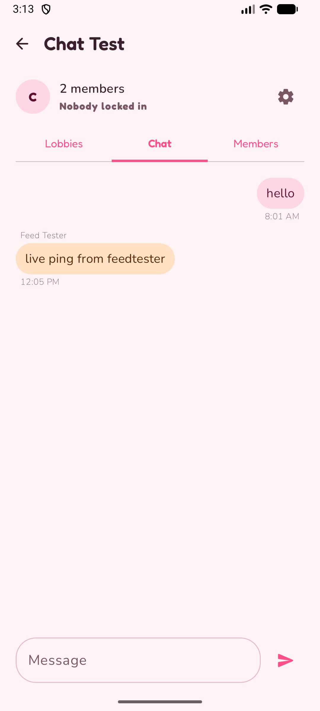</td>
    <td>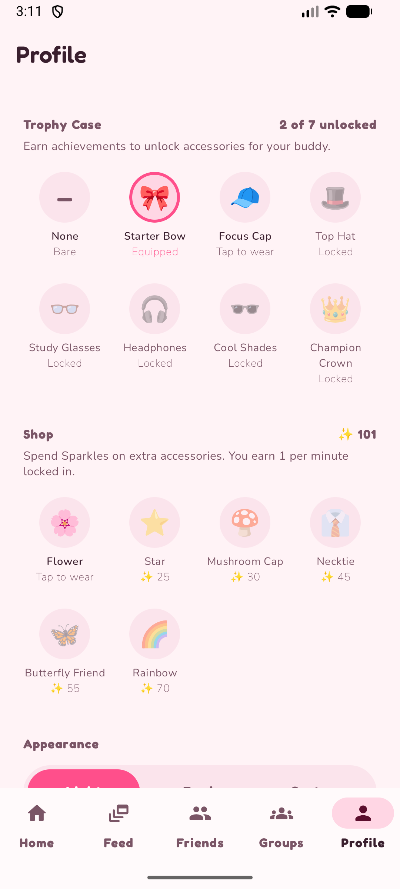</td>
  </tr>
  <tr>
    <td>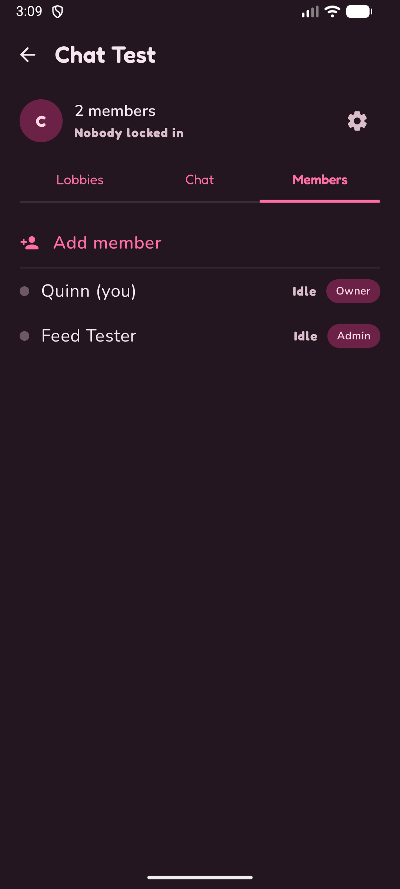</td>
    <td>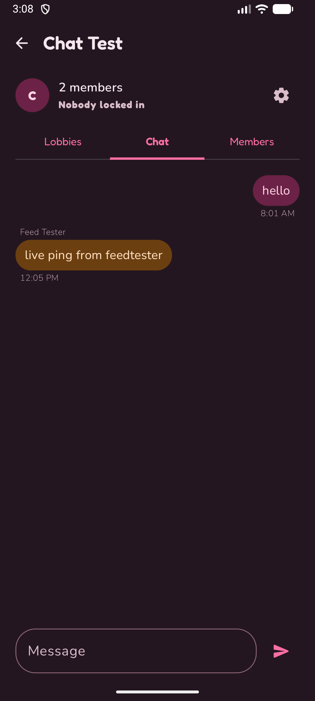</td>
    <td>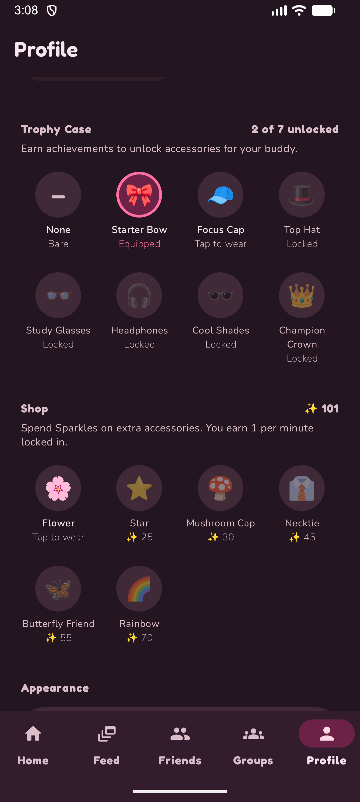</td>
  </tr>
</table>

<p align="center"><i>Every screen ships in both light and dark.</i></p>

<details>
<summary><b>More: achievements & profile</b></summary>

<table>
  <tr>
    <td>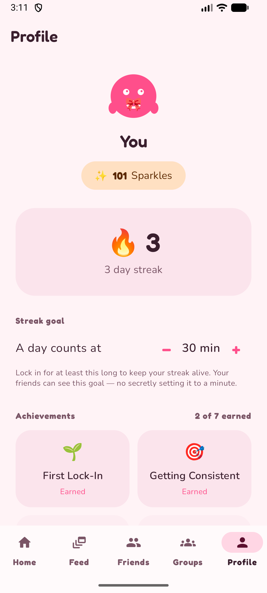</td>
    <td>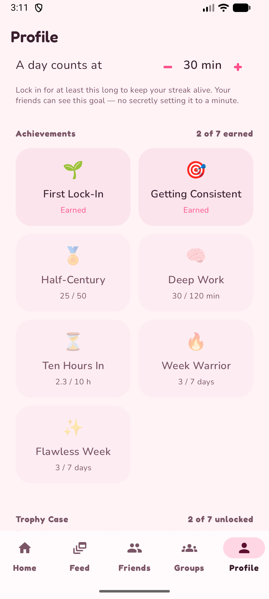</td>
    <td>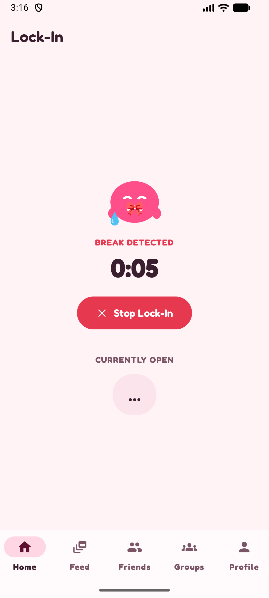</td>
  </tr>
  <tr>
    <td align="center"><i>Profile — streak & Sparkles</i></td>
    <td align="center"><i>Achievements</i></td>
    <td align="center"><i>Break detected</i></td>
  </tr>
</table>

</details>

---

## How the anti-cheat works

The whole trust model rests on one rule: **detection fails closed.**

```kotlin
// Compliant only if we can positively prove focus. Anything else is a BREAK.
val isCompliant = !isScreenOn ||                       // screen off is fine
    foregroundApp == ownPackageName ||                 // you're in Lock-In
    allowlist.contains(foregroundApp)                  // you're on an allowed app
// foregroundApp == null (e.g. Usage Access was revoked mid-session) is NOT compliant.
```

- **Foreground detection** uses `UsageStatsManager` polled from a foreground `Service` — a purely *local*
  query, so it keeps working with no network (airplane mode doesn't defeat the solo alarm).
- **Revoking Usage Access** mid-session makes the query return `null`. Rather than treat "I can't see
  anything" as "everything's fine," the service escalates it to a break on the very first tick.
- **Force-stopping the app** kills the alarm — so a per-tick **heartbeat** timestamp is persisted; if it
  goes stale, the next app launch reconciles and voids the session (no credit, flagged interrupted).
- **Group alarms are sticky** and can't be dismissed with the Stop button — they clear only on group
  approval or a hard 2-minute cap, so "just hit stop" isn't an escape hatch.

> **Honest scope note.** This is a proof-of-concept. Detection can occasionally false-positive, and a
> rooted device can defeat any client-side check — stated plainly rather than hidden. The goal was to
> design a *credible* fail-closed trust layer, not an unbeatable one.

---

## Tech stack

| Layer | Choice |
|---|---|
| Language / UI | **Kotlin**, **Jetpack Compose** (no XML views) |
| Backend | **Firebase** — Auth (email/password) + **Cloud Firestore** |
| Detection | `UsageStatsManager` polling inside a foreground `Service` |
| State | Kotlin `StateFlow` + Compose `collectAsState`; real-time Firestore listeners |
| Security | Firestore Security Rules enforce ownership, friend-visibility, and role/admin writes |
| Min / Target SDK | 24 / 36 |

No Cloud Functions — social fan-out (feed, kudos, presence) is done on the client and enforced by rules.

For the full data model, key decisions, and rationale, see **[`ARCHITECTURE.md`](ARCHITECTURE.md)** (and
**[`CONTEXT.md`](CONTEXT.md)** for the product "why").

---

## Build & run

This is a portfolio project wired to my own Firebase project, so `google-services.json` is **not** checked
in. To run it you'll point it at a Firebase project of your own:

1. **Clone** and open in Android Studio (a recent Giraffe+/AGP-9 toolchain).
2. **Create a Firebase project** → enable **Authentication** (Email/Password) and **Cloud Firestore**.
3. **Add an Android app** with package `com.example.lockin`, download its **`google-services.json`**, and
   drop it in `app/`.
4. **Deploy the rules** in [`firestore.rules`](firestore.rules) (`firebase deploy --only firestore:rules`).
5. **Run** on a device or emulator (API 24+). On first launch, grant **Usage Access** and **notifications**
   when the onboarding flow asks — they're what make detection and break alerts work.

---

## Project status

Feature-complete proof-of-concept, built solo across nine staged milestones (solo core → accounts/sync →
friends → group lock-ins → social feed + gamification → cute redesign & mascot economy → anti-cheat
hardening → social refinement → polish). Everything shown here is verified running on an emulator.
